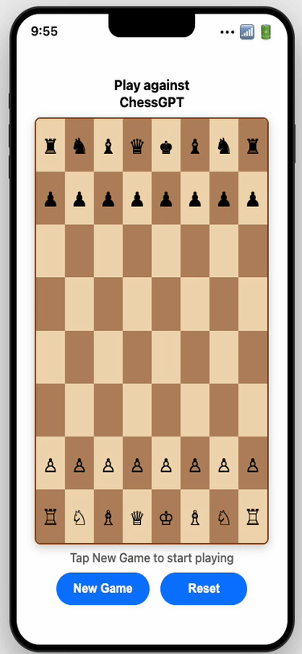

# Chess-GPT: The Mobile Small Language Model 🚀

<div align="center">
  
</div>

> **Just deployed a language model to a smart device**
> Here's how — full engineering workflow inside.

**Fast, Privacy, Low Cost** - Complete pipeline for training and deploying chess AI models that run locally on smart devices without cloud dependencies.

   

## The Mobile SLM Revolution

### Why Edge AI Changes Everything

After years of cloud-dependent LLMs, this project proves something important: **Small Language Models can thrive on mobile devices**.

#### The Problem with Cloud LLMs

We've become too dependent on proprietary third-party APIs. But real competitive advantage comes from:

- **Speed**: <300ms inference vs. API latency
- **Privacy**: Your data never leaves the device
- **Cost**: Zero cloud compute bills
- **Reliability**: Works offline, always

#### Our Proof of Concept: Chess AI Running Natively on iPhone

This open-source chess app demonstrates a fine-tuned SLM running **entirely on iPhone—no cloud, no API**.

**Technical Stack:**
- **Model**: Liquid AI's 350M parameter model, fine-tuned on grandmaster games
- **Inference**: Leap Edge SDK for iPhone-native deployment
- **Performance**: <200ms response time on iPhone 14/15
- **Privacy**: 100% offline on your iPhone
- **Size**: Entire model fits in iPhone storage (280MB)

#### Why This Matters for Enterprise

This isn't about chess—it's about the future of enterprise AI:

- **Compliance-ready**: Data sovereignty guaranteed
- **Scalable**: No per-request pricing
- **Responsive**: Real-time user experience
- **Customizable**: Task-specific fine-tuning

**The paradigm shift**: Stop renting intelligence from proprietary cloud providers. Start owning it on every device in your organization.

#### Real-World Business Applications

This chess demo proves the foundation for transformative edge AI across industries:

- **Healthcare**: Patient data analysis without cloud transmission—imagine diagnostic AI on every doctor's iPhone
- **Finance**: Real-time fraud detection at the edge—instant alerts without exposing transaction data
- **Manufacturing**: Quality control with instant AI feedback—floor supervisors with AI-powered mobile inspection
- **Legal**: Document analysis with complete privacy—sensitive contracts reviewed on-device
- **Education**: Personalized tutoring without internet dependency—learning apps that work everywhere

---

**Core Innovation**: Train large language models to play chess like Magnus Carlsen, then deploy lightweight versions that run entirely on-device for maximum privacy and speed.

## Features

- **Fast**: Unsloth optimizations provide 2-4x training speedup
- **Privacy**: Models run locally - no data leaves your device
- **Smart Device Ready**: Optimized for mobile and edge deployment
- **Real-time**: Sub-second move generation on mobile devices
- **Magnus Style**: Trained on world champion's game patterns

## Quick Start Tutorial

### Step 1: Environment Setup

```bash
# Install UV package manager
curl -LsSf https://astral.sh/uv/install.sh | sh

# Clone repository
git clone https://github.com/yourusername/chess-gpt.git
cd chess-gpt
```

### Step 2: Install Dependencies

```bash
# Install core dependencies
uv sync

# Install training dependencies
uv sync --extra training

# Setup Modal cloud account (free tier available)
uv run modal token new
```

### Step 3: Configure API Keys

```bash
cd fine-tuning
cp .env.example .env

# Edit .env with your keys:
# MODAL_TOKEN_ID=your_modal_token
# MODAL_TOKEN_SECRET=your_modal_secret
# WANDB_API_KEY=your_wandb_key (optional)
# HF_TOKEN=your_huggingface_token
```

### Step 4: Process Training Data

```bash
# Navigate to fine-tuning directory
cd fine-tuning

# Install dependencies
make install

# Setup project structure
make setup

# Process Magnus Carlsen games into training format
make process-data

# Optional: Download additional training datasets
# Visit: https://www.pgnmentor.com/files.html#players
# Contains games from world champions and top players
```

### Step 5: Estimate Training Cost

```bash
# Check estimated costs before training
make estimate-cost

# Expected output:.
# GPU Type: L40S (48GB VRAM)
# Training Time: ~3 hours
# Estimated Cost: ~$9
```

### Step 6: Launch Cloud Training

```bash
# Start training on Modal cloud
make train

# Monitor progress
make monitor
```

### Step 7: Evaluate Model Performance

```bash
# Test against baselines
make evaluate

# Expected output:
# Model vs Random: 95% win rate
# Model vs Stockfish Level 1: 60% win rate
# Sanity checks: 8/10 passed
```

### Step 8: Deploy to Smart Device

```bash
# Merge LoRA adapters with base model
make merge-model

# Export for mobile deployment
make export-mobile

# Deploy to device (iOS/Android)
make deploy-device
```

### Step 9: Test Local Chess AI

```bash
# Run local web demo
python -m http.server 8000 -d ../chess-gpt/

# Open browser to localhost:8000/chess_your_model.html
# Play against your trained model locally!
```

### Step 10: Production Optimization

```bash
# Quantize model for faster inference
make quantize

# Benchmark performance
make benchmark

# Expected results:
# Model size: 95MB → 25MB (quantized)
# Inference speed: 50ms → 15ms per move
# Memory usage: 200MB → 80MB
```

## Project Architecture

```
chess-gpt/
├── fine-tuning/                 # ML Training Pipeline
│   ├── src/chess_gpt/          # Core ML modules
│   │   ├── config.py           # Pydantic configuration
│   │   ├── data_processing.py  # Dataset processing
│   │   ├── model_setup.py      # Model & LoRA configuration
│   │   ├── trainer.py          # Training orchestration
│   │   ├── prompt.py           # Chess prompt engineering
│   │   ├── main.py             # Modal entry point
│   │   ├── infra.py            # Infrastructure setup
│   │   ├── evaluate.py         # Model evaluation
│   │   └── players.py          # Chess player interfaces
│   ├── scripts/                # Utility scripts
│   │   ├── generate_instruction_dataset.py
│   │   ├── generate_merged_model.py
│   │   └── push_model_to_hf.py
│   ├── data/                   # Training data
│   │   ├── raw/               # PGN chess games
│   │   └── processed/         # Instruction datasets
│   ├── models/                 # Trained models
│   ├── outputs/                # Training outputs
│   ├── Makefile               # Automation commands
│   └── pyproject.toml         # Dependencies
├── game/                       # iOS Chess App
│   ├── ChessGPT/              # SwiftUI Application
│   │   ├── Core/              # App lifecycle
│   │   │   └── ChessGPTApp.swift
│   │   ├── Managers/          # Business logic
│   │   │   ├── ChessAIManager.swift
│   │   │   └── GameManager.swift
│   │   ├── Views/             # UI Components
│   │   │   ├── ContentView.swift
│   │   │   └── BoardView.swift
│   │   └── Resources/         # AI Model bundles
│   │       └── LFM2-350M-MagnusInstruct.bundle
│   ├── ChessGPT.xcodeproj     # Xcode project
│   └── README.md              # iOS app documentation
├── media/                      # Visual assets
│   └── chess_gameplay_7_moves.gif
└── README.md                  # Project overview
```


## Monitoring & Debugging

### Weights & Biases Integration

```bash
# Login to W&B
make wandb-login

# Monitor training in real-time
# Visit: https://wandb.ai/your-project/runs
```

### Modal Dashboard

```bash
# View training logs
make modal-logs

# Monitor GPU utilization
make modal-status
```

### Common Issues & Solutions

1. **GPU Out of Memory**
   ```bash
   # Reduce batch size
   export BATCH_SIZE=8
   # Enable gradient checkpointing
   export USE_GRADIENT_CHECKPOINTING=true
   ```

2. **Training Instability**
   ```bash
   # Lower learning rate
   export LEARNING_RATE=1e-4
   # Increase warmup
   export WARMUP_RATIO=0.1
   ```

3. **Slow Inference**
   ```bash
   # Quantize model
   make quantize
   # Use ONNX runtime
   make export-onnx
   ```

## Contributing

1. **Fork the repository**
2. **Create feature branch**: `git checkout -b feature/amazing-feature`
3. **Follow code standards**: Use logging, type hints, docstrings
4. **Add tests**: `make test`
5. **Submit pull request**

### Development Setup

```bash
# Install development dependencies
uv sync --extra dev

# Run code formatting
make format

# Run linting
make lint

# Run type checking
make typecheck

# Run all tests
make test
```

## Acknowledgments

- **Pau Labarta Bajo** - MLE expert, mentor
- **Magnus Carlsen** - Training data source
- **Unsloth AI** - Training optimizations
- **Modal** - Serverless cloud infrastructure
- **HuggingFace** - Model hosting and transformers
- **Chess.com** - Game data and inspiration

---

*Fast • Privacy-First • Production-Ready*